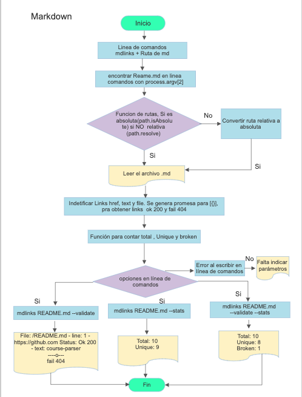

# Markdown Links

Una libreria que ayudara a poder detectar links y conocer el status del mismo
  - Status 200: La petición se ha recibido, se ha procesado y se ha devuelto satisfactoriamente.
  - Fail 404: El recurso no está disponible en el servidor o quizá lo estuvo en el pasado y ha sido borrado   o quizá has escrito la dirección web mal.

### Diagrama de flujo

  - Diagrama de flujo para resolver la parte tecnica de la libreria

 

### Herramientas

 - Elaborada con Javascript vanilla
 - Complementos de librerias de Node como : npm markdown-link-extractor, npm promised-url-exists, npm color

### Uso en linea de comandos 

Para poder hacer uso de esta libreria lo primero que debemos hacer es escribir la palabra mdlinks + Nombre del Readme + opcion 
1) mdlinks README.md --validate 
  - File: Ruta del archivo que lo esta leyendo 
  - Numero de lineas con links + URL encontrada 
  - Status: ok 200 o fail 404 
2) mdlinks README.md --stats 
  - Total de links encontrados
  - Total de links unicos (que no se repite la URL)
3) mdlinks README.md --stats --validate 
  - Total de links encontrados
  - Total de links unicos (que no se repite la URL)
  - Total de links rotos 